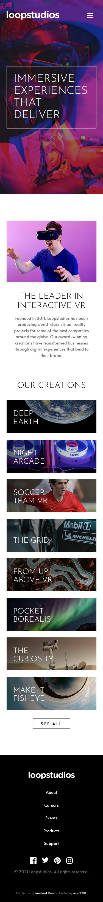
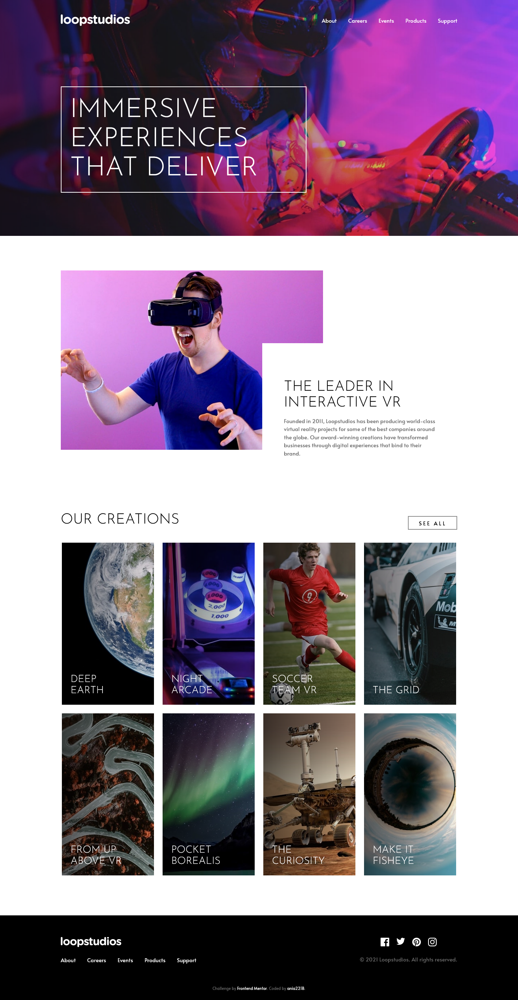

# Frontend Mentor - Loopstudios landing page solution

This is a solution to the [Loopstudios landing page challenge on Frontend Mentor](https://www.frontendmentor.io/challenges/loopstudios-landing-page-N88J5Onjw). Frontend Mentor challenges help you improve your coding skills by building realistic projects.

## Table of contents

- [Overview](#overview)
  - [The challenge](#the-challenge)
  - [Screenshot](#screenshot)
  - [Links](#links)
- [My process](#my-process)
  - [Built with](#built-with)
  - [Continued development](#continued-development)
- [Author](#author)

## Overview

### The challenge

Users should be able to:

- View the optimal layout for the site depending on their device's screen size
- See hover states for all interactive elements on the page

### Screenshot

### Links

- Solution URL: [GitHub](https://github.com/ania221B/loopstudios-landing-page-fem)
- Live Site URL: [GitHubPages](https://ania221b.github.io/loopstudios-landing-page-fem/)

## My process

### Built with

- Semantic HTML5 markup
- SCSS
- CSS custom properties
- Flexbox
- CSS Grid
- Mobile-first workflow

### Continued development

- SCSS / Sass
- svg
- animations / transitions

## Author

- Frontend Mentor - [@ania221b](https://www.frontendmentor.io/profile/ania221b)

## Acknowledgements

- This template was build as part of [Beyond CSS](https://www.beyondcss.dev/) course by [Kevin Powell](https://www.kevinpowell.co/)
- You can find Kevin's template on [his GitHub](https://github.com/kevin-powell)
